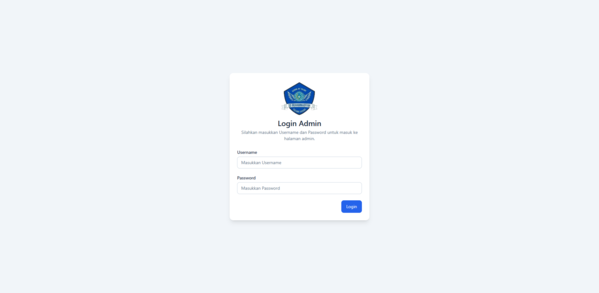
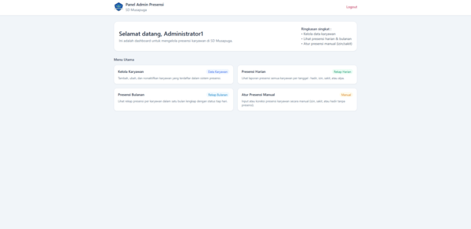
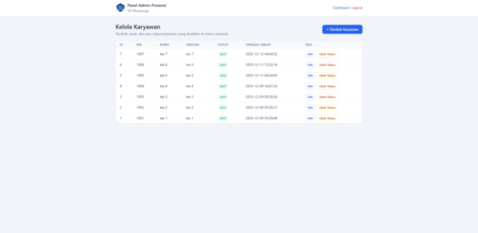
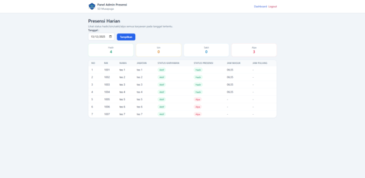
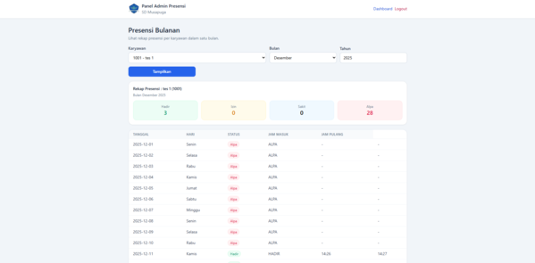

# Sistem Presensi SD Musapuga

🔴Live Demo : [Klik disini](https://presensi-demo.free.nf/) atau https://presensi-demo.free.nf/

Login admin demo :
username : `binx`
password : `123`

NIK demo yang terdaftar untuk presensi karyawan :
- 1001
- 1002
- 1003
- 1004
- 1005
- 1006
- 1007

Aplikasi web sederhana untuk mengelola presensi karyawan (guru dan staf) SD Musapuga.
Karyawan melakukan presensi dengan NIK, dan admin dapat mengelola data karyawan serta melihat laporan kehadiran harian dan bulanan.

---

## Tampilan Aplikasi

### Halaman Presensi Karyawan

### Login & Dashboard Admin

### Kelola Karyawan

### Laporan Presensi

## Fitur

### Presensi Karyawan

- Presensi **MASUK** dan **PULANG** menggunakan NIK
- Sehari hanya bisa 1x presensi **MASUK** dan 1x presensi **PULANG**
- Jika tidak ada presensi dianggap **ALPA**

### Status Kehadiran

- Status presensi yang didukung :
  - Hadir
  - Izin
  - Sakit
  - Alpa (otomatis jika tidak ada data presensi pada hari tersebut)

### Panel Admin

- Login admin (username + password yang sudah dihash)
- **Kelola Karyawan**
  - Tambah karyawan baru
  - Edit data karyawan
  - Menonaktifkan / mengaktifkan karyawan (tanpa menghapus data)
- **Presensi Harian**
  - Rekap Hadir, Izin, Sakit, Alpa semua karyawan pada tanggal tertentu
- **Presensi Bulanan**
  - Rekap presensi karyawan dalam satu bulan penuh
- **Atur Presensi Manual**
  - Input presensi manual (Hadir, Izin, Sakit) untuk karyawan pada tanggal tertentu
  - Menambahkan keterangan (misalnya : izin pergi ke luar kota, sakit dengan surat dokter, dll)
  - Jika sudah ada presensi hari itu, data akan diupdate

## Teknologi yang digunakan

- PHP (native, tanpa framework)
- MySQL
- TailwindCSS v3.4

---
